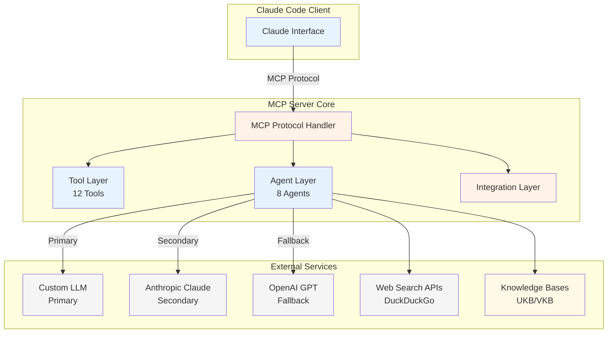
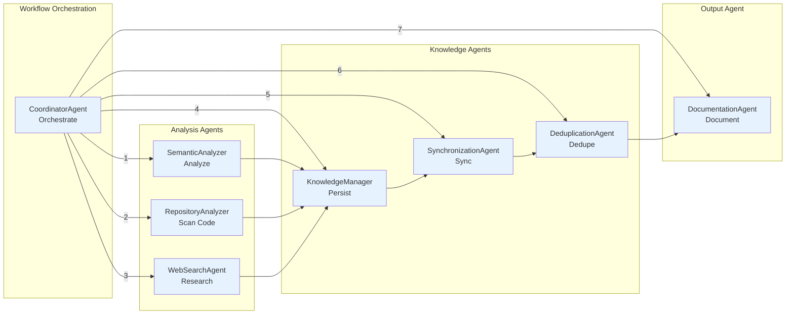
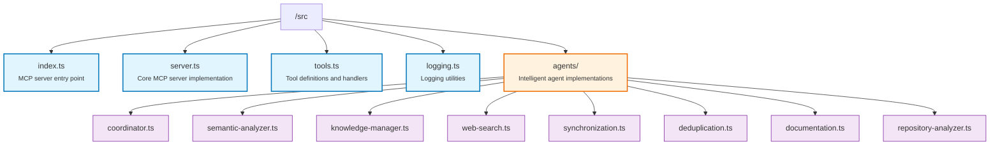

# MCP Server - Semantic Analysis

🚀 **Model Context Protocol (MCP) server for semantic analysis and knowledge management** - A standalone Node.js server providing AI-powered code analysis, pattern extraction, and knowledge base management through standardized MCP tools.

## Overview

This MCP server integrates seamlessly with Claude Code to provide advanced semantic analysis capabilities. Built entirely in Node.js with TypeScript, it offers **12 specialized tools** and **8 intelligent agents** for comprehensive code and knowledge analysis.

### 🤖 Intelligent Agents (8 Specialized)
- **`CoordinatorAgent`** - Workflow orchestration and QA validation
- **`SemanticAnalyzer`** - AI-powered content and code analysis
- **`KnowledgeManager`** - Knowledge base management and integration
- **`WebSearchAgent`** - Technical documentation search and validation
- **`SynchronizationAgent`** - Multi-source data synchronization
- **`DeduplicationAgent`** - Semantic duplicate detection and merging
- **`DocumentationAgent`** - Automated insight document generation
- **`RepositoryAnalyzer`** - Repository structure and pattern analysis

## ✨ Key Features

### 🔧 MCP Tools (12 Available)
- **`heartbeat`** - Connection health monitoring
- **`test_connection`** - Server connectivity verification
- **`determine_insights`** - AI-powered content insight extraction
- **`analyze_code`** - Code pattern and quality analysis
- **`analyze_repository`** - Repository-wide architecture analysis
- **`extract_patterns`** - Reusable design pattern identification
- **`create_ukb_entity_with_insight`** - Knowledge base entity creation
- **`execute_workflow`** - Coordinated multi-agent workflows
- **`generate_documentation`** - Automated documentation generation
- **`create_insight_report`** - Detailed analysis reports
- **`generate_plantuml_diagrams`** - Architecture diagram generation
- **`generate_lessons_learned`** - Lessons learned document creation

### 🔗 Integration Capabilities
- **Claude Code Integration** - Full MCP compatibility
- **Multiple LLM Providers** - Custom LLM (primary), Anthropic Claude (secondary), OpenAI GPT (fallback)
- **Knowledge Base Support** - UKB/VKB integration
- **PlantUML Diagrams** - Architecture visualization
- **Web Search** - Technical documentation discovery

### 🚀 Performance & Stability
- **Node.js Advantages** - No Python environment issues, stable connections
- **Smart Fallbacks** - Automatic provider switching on failures
- **Error Recovery** - Graceful degradation and retry logic

## 🚀 Quick Start

### Prerequisites
- Node.js 18+ 
- API keys for LLM providers (Anthropic recommended, OpenAI optional)

### Installation

```bash
# Clone or navigate to the server directory
cd integrations/mcp-server-semantic-analysis

# Install dependencies
npm install

# Build the server
npm run build

# Test the installation
npm run dev
```

### Configuration

1. **API Keys Setup**: Configure in your environment or the parent system
2. **Claude Code Integration**: The server automatically integrates when started via `claude-mcp`
3. **LLM Provider Priority**: Custom LLM (primary) → Anthropic (secondary) → OpenAI (fallback)

### Usage with Claude Code

```bash
# Start Claude Code with MCP support
claude-mcp

# The semantic-analysis server will be automatically available
# Use any of the 12 tools directly in Claude conversations
```

## 🔧 API Reference Summary

### Tool Categories

#### Connection & Health
```typescript
heartbeat() → ServerStatus
test_connection() → ConnectionInfo
```

#### Analysis Tools
```typescript
determine_insights(content, context?, analysis_type?, provider?) → Insights
analyze_code(code, language?, file_path?, analysis_focus?) → CodeAnalysis
analyze_repository(repository_path, include_patterns?, exclude_patterns?, max_files?) → RepositoryAnalysis
extract_patterns(source, pattern_types?, context?) → ExtractedPatterns
```

#### Knowledge Management
```typescript
create_ukb_entity_with_insight(entity_name, entity_type, insights, significance?, tags?) → EntityCreationResult
execute_workflow(workflow_name, parameters?) → WorkflowResult
```

#### Documentation & Reporting
```typescript
generate_documentation(analysis_result, metadata?) → Documentation
create_insight_report(analysis_result, metadata?) → InsightReport
generate_plantuml_diagrams(diagram_type, content, name, analysis_result?) → PlantUMLDiagram
generate_lessons_learned(analysis_result, title?, metadata?) → LessonsLearned
```

## 🏗️ Architecture Overview

### System Architecture



### Agent Coordination



## 📚 Detailed Documentation

### Core Documentation
- **[Installation Guide](docs/installation/README.md)** - Complete setup and configuration
- **[Architecture Details](docs/architecture/README.md)** - Technical architecture and design patterns
- **[API Reference](docs/api/README.md)** - Complete tool and agent API documentation

### Diagrams and Visualizations
- **[Architecture Diagrams](docs/images/)** - PlantUML-generated system diagrams
- **[PlantUML Source](docs/puml/)** - Editable diagram source files

### Advanced Topics
- **[Agent Development](docs/architecture/agents.md)** - Creating custom agents
- **[Tool Extensions](docs/architecture/tools.md)** - Adding new MCP tools
- **[Integration Patterns](docs/architecture/integration.md)** - External system integration

## 🎯 Use Cases

### 1. **Code Analysis Workflow**
```typescript
// Analyze repository structure
const repoAnalysis = await analyze_repository("/path/to/repo");

// Extract specific patterns
const patterns = await extract_patterns(repoAnalysis.content);

// Generate documentation
const docs = await generate_documentation(patterns);

// Create knowledge base entry
await create_ukb_entity_with_insight("RepoPatterns", "ArchitecturalPattern", docs.content);
```

### 2. **Insight Generation Pipeline**
```typescript
// Analyze content for insights
const insights = await determine_insights(content, context, "architecture", "anthropic");

// Create comprehensive report
const report = await create_insight_report(insights, {name: "SystemAnalysis"});

// Generate supporting diagrams
await generate_plantuml_diagrams("architecture", "System Overview", "system-arch");
```

### 3. **Knowledge Management**
```typescript
// Execute comprehensive analysis workflow
const workflow = await execute_workflow("complete-analysis", {
  repository_path: "/path/to/project",
  include_documentation: true,
  generate_diagrams: true
});

// Generate lessons learned
await generate_lessons_learned(workflow.result, "Project Analysis Insights");
```

## 🔌 Integration with Main System

This MCP server is designed to integrate seamlessly with the broader coding knowledge management system:

### Main System Architecture Integration


### Configuration Files
- **Template**: `claude-code-mcp.json` (with placeholders)
- **Processed**: `claude-code-mcp-processed.json` (actual paths)
- **Claude Config**: `~/.claude.json` (Claude Code configuration)

### Shared Knowledge
- **UKB Integration**: Creates and updates Universal Knowledge Base entities
- **VKB Compatibility**: Supports knowledge visualization workflows  
- **Cross-Session Persistence**: Maintains context across Claude sessions

## 🚀 Performance & Stability

### Node.js Advantages
- **No Python Environment Issues** - Eliminates venv conflicts and dependency hell
- **Stable Connections** - No 60-second connection drops
- **Fast Startup** - Immediate availability
- **Resource Efficiency** - Lower memory footprint

### Provider Management
- **Smart Fallbacks** - Automatic provider switching on failures
- **Rate Limiting** - Built-in request throttling
- **Error Recovery** - Graceful degradation and retry logic

### Monitoring
- **Health Checks** - Built-in connection monitoring
- **Logging** - Structured logging with correlation IDs
- **Metrics** - Performance tracking and analytics

## 🛠️ Development

### Building from Source
```bash
# Development mode with watching
npm run watch

# Production build
npm run build

# Run tests
npm run test
```

### Project Structure


## 📄 License

MIT License - See parent project for details.

## 🤝 Contributing

This server is part of the larger coding knowledge management system. Contributions should align with the overall system architecture and patterns.

### Development Guidelines
- Follow TypeScript best practices
- Maintain MCP protocol compliance
- Add comprehensive tests for new tools/agents
- Update documentation for new features

## 📞 Support & Troubleshooting

For issues and support:
1. Check the [troubleshooting guide](docs/troubleshooting.md)
2. Review MCP server logs
3. Verify API key configuration
4. Test with simple tools first (`heartbeat`, `test_connection`)

---

**🔗 Related Projects:**
- [Main Coding System](../../README.md) - Parent project documentation
- [UKB Documentation](../../docs/ukb/README.md) - Universal Knowledge Base
- [VKB Documentation](../../docs/vkb/README.md) - Knowledge Visualization

**🏷️ Tags:** MCP, Semantic Analysis, Claude Code, Node.js, TypeScript, AI, Knowledge Management