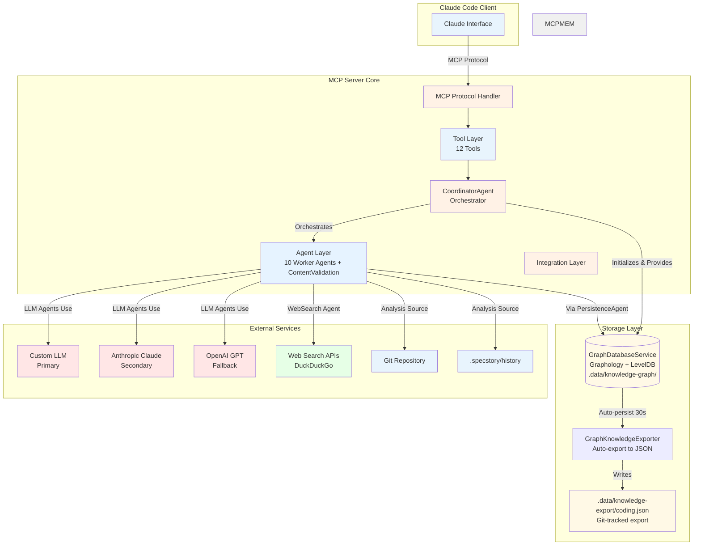
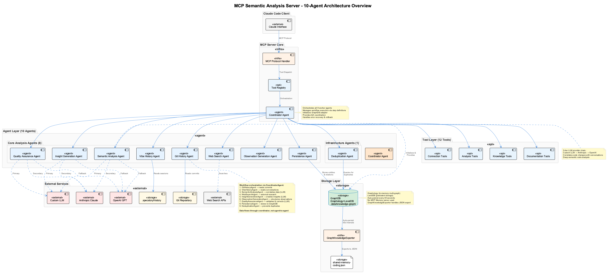

# MCP Server - Semantic Analysis

🚀 **Model Context Protocol (MCP) server for semantic analysis and knowledge management** - A standalone Node.js server providing AI-powered code analysis, pattern extraction, and knowledge base management through standardized MCP tools.

## Overview

This MCP server integrates seamlessly with Claude Code to provide advanced semantic analysis capabilities. Built entirely in Node.js with TypeScript, it offers **12 specialized tools** and **11 intelligent agents** with **Graphology+LevelDB graph database** persistence for comprehensive code and knowledge analysis.

### 🤖 Intelligent Agents (11 Total)

#### Core Analysis Agents (8 Agents) - 🧠 LLM-Enhanced
1. **`GitHistoryAgent`** - Analyzes git commits from checkpoint with architectural decisions
2. **`VibeHistoryAgent`** 🧠 - LLM-powered session summaries with pattern analysis and recommendations
3. **`SemanticAnalysisAgent`** 🧠 - Deep LLM code analysis correlating git and conversation data
4. **`WebSearchAgent`** 🧠 - External research with LLM semantic relevance scoring (40% keyword + 60% semantic)
5. **`InsightGenerationAgent`** 🧠 - LLM-powered insight generation with PlantUML diagrams and patterns
6. **`ObservationGenerationAgent`** 🧠 - LLM extracts structured insights, domain classification, actionable recommendations
7. **`QualityAssuranceAgent`** 🧠 - LLM semantic validation detecting conversation fragments, generic content, quality assessment
8. **`PersistenceAgent`** - Persists entities to Graphology+LevelDB graph database with ontology-based classification

#### Infrastructure Agents (2 Agents) - 🔢 Embedding-Enhanced
9. **`DeduplicationAgent`** 🔢 - OpenAI embeddings (text-embedding-3-small) with cosine similarity for semantic duplicate detection
10. **`ContentValidationAgent`** - Validates entity content accuracy, detects stale knowledge, and generates refresh recommendations

#### Orchestration Agent (1 Agent)
11. **`CoordinatorAgent`** - Workflow orchestration, task scheduling, and agent coordination with GraphDB integration

## ✨ Key Features

### 🔧 MCP Tools (12 Available)
- **`heartbeat`** - Connection health monitoring
- **`test_connection`** - Server connectivity verification
- **`determine_insights`** - AI-powered content insight extraction
- **`analyze_code`** - Code pattern and quality analysis
- **`analyze_repository`** - Repository-wide architecture analysis
- **`extract_patterns`** - Reusable design pattern identification
- **`create_ukb_entity_with_insight`** - Knowledge base entity creation
- **`execute_workflow`** - Coordinated 11-agent workflows
- **`generate_documentation`** - Automated documentation generation
- **`create_insight_report`** - Detailed analysis reports
- **`generate_plantuml_diagrams`** - Architecture diagram generation
- **`generate_lessons_learned`** - Lessons learned document creation

### 🔗 Integration Capabilities
- **Claude Code Integration** - Full MCP compatibility
- **4-Tier LLM Provider Chain** - Groq (1st) → Gemini (2nd) → Custom LLM (3rd) → Anthropic Claude (4th) → OpenAI GPT (fallback)
- **OpenAI Embeddings** - text-embedding-3-small for semantic similarity and deduplication
- **Graph Database Persistence** - Graphology (in-memory) + LevelDB (persistent storage) at `.data/knowledge-graph/`
- **Knowledge Base Support** - UKB/VKB integration with automatic graph export to .data/knowledge-export/*.json
- **PlantUML Diagrams** - Architecture visualization
- **Web Search** - Technical documentation discovery with semantic relevance scoring
- **Git & Conversation Analysis** - Cross-correlates code changes with development discussions using LLM semantic understanding
- **Ontology-Based Classification** - Automatic entity type classification using hybrid heuristics + LLM approach

### 🎯 Ontology Classification System

The PersistenceAgent now features intelligent entity classification using a 5-layer hybrid approach:

1. **Team Context Filtering** - Narrows to team-specific ontology (coding, RaaS, UI, etc.)
2. **Entity Pattern Analysis** - Matches structural patterns (e.g., LSLSession file format, MCP protocols)
3. **Enhanced Keyword Matching** - Weighted keyword scoring with domain terminology
4. **Semantic Embedding Similarity** - Vector-based semantic matching (when available)
5. **LLM Classification** - Claude/GPT fallback for ambiguous cases (optional)

**Classification Performance:**
- ⚡ **Heuristic-first**: 90% of entities classified in <100ms
- 📊 **High Accuracy**: 0.85-0.95 confidence scores for most entity types
- 🔄 **Graceful Fallback**: Default to `TransferablePattern` when confidence < threshold
- 📝 **Full Metadata**: All classifications include confidence scores, methods, and reasoning

**Supported Entity Types** (33 types in coding ontology):
- `LSLSession`, `MCPAgent`, `GraphDatabase`, `KnowledgeEntity`
- `WorkflowDefinition`, `ServiceRegistry`, `EmbeddingVector`
- `TransferablePattern` (generic fallback)
- And 26 more specialized types

**Configuration:**
```typescript
const persistenceAgent = new PersistenceAgent(repoPath, graphDB, {
  enableOntology: true,           // Enable classification (default: true)
  ontologyTeam: 'coding',          // Team-specific ontology
  ontologyMinConfidence: 0.7       // Confidence threshold
});
```

### 🧠 LLM Enhancement System

Five core agents now leverage advanced LLM capabilities through the `SemanticAnalyzer` service:

#### Enhanced Agents

**1. Vibe History Agent** - Session Analysis
- **Capability**: Generates executive summaries from conversation patterns
- **Output**: Key patterns discovered, actionable recommendations, trend analysis
- **Benefit**: Transforms raw session logs into strategic insights

**2. Observation Generation Agent** - Insight Extraction
- **Capability**: Extracts structured insights with domain classification
- **Output**: Key learnings, technical domain, applicability scope, actionable recommendations
- **Benefit**: Enriches observations with deeper semantic understanding

**3. Quality Assurance Agent** - Semantic Validation
- **Capability**: Detects conversation fragments, generic content, vague patterns
- **Output**: Quality assessment (high/medium/low) with confidence scores and specific issues
- **Benefit**: Prevents low-quality content from entering knowledge base

**4. Web Search Agent** - Relevance Scoring
- **Capability**: Blends keyword matching (40%) with semantic understanding (60%)
- **Output**: Semantically-ranked search results with relevance reasoning
- **Benefit**: Surfaces most contextually relevant results beyond keyword matches

**5. Semantic Analysis Agent** - Code Correlation
- **Capability**: Correlates code changes with conversation context using deep semantic analysis
- **Output**: Insights connecting implementation decisions to discussion context
- **Benefit**: Captures the "why" behind code changes

#### Embedding-Based Deduplication

**Deduplication Agent** now uses OpenAI `text-embedding-3-small`:
- **Capability**: Vector-based semantic similarity with cosine distance
- **Fallback**: Graceful degradation to Jaccard text similarity
- **Benefit**: Detects semantically similar entities even with different wording

#### 4-Tier LLM Provider Chain

All LLM-enhanced agents use the `SemanticAnalyzer` with automatic failover:

```
Groq → Gemini → Custom LLM → Anthropic → OpenAI
```

**Benefits:**
- 🚀 Fast responses from Groq when available
- 💪 Reliability through multiple fallback providers
- 💰 Cost optimization by preferring cheaper providers
- 🔄 Automatic provider switching on failures

### 🚀 Performance & Stability
- **Node.js Advantages** - No Python environment issues, stable connections
- **Smart Fallbacks** - Automatic provider switching on failures
- **Error Recovery** - Graceful degradation and retry logic
- **Checkpoint Management** - Prevents duplicate analysis work

## 🚀 Quick Start

### Prerequisites
- Node.js 18+
- API keys for LLM providers:
  - **Groq** (recommended for speed) - GROQ_API_KEY
  - **Gemini** (recommended for reliability) - GEMINI_API_KEY
  - **Anthropic** (high quality) - ANTHROPIC_API_KEY
  - **OpenAI** (embeddings + fallback) - OPENAI_API_KEY
  - Note: Only OPENAI_API_KEY is required for deduplication embeddings; others are optional with automatic fallback

### Installation

```bash
# Clone or navigate to the server directory
cd integrations/mcp-server-semantic-analysis

# Install dependencies
npm install

# Build the server
npm run build

# Test the installation
npm run dev
```

### Configuration

1. **API Keys Setup**: Configure in your environment or the parent system
2. **Claude Code Integration**: The server automatically integrates when started via `claude-mcp`
3. **LLM Provider Priority**: Groq (1st) → Gemini (2nd) → Custom LLM (3rd) → Anthropic (4th) → OpenAI (fallback)

### Usage with Claude Code

```bash
# Start Claude Code with MCP support
claude-mcp

# The semantic-analysis server will be automatically available
# Use any of the 12 tools directly in Claude conversations
```

## 🔧 API Reference Summary

### Tool Categories

#### Connection & Health
```typescript
heartbeat() → ServerStatus
test_connection() → ConnectionInfo
```

#### Analysis Tools
```typescript
determine_insights(content, context?, analysis_type?, provider?) → Insights
analyze_code(code, language?, file_path?, analysis_focus?) → CodeAnalysis
analyze_repository(repository_path, include_patterns?, exclude_patterns?, max_files?) → RepositoryAnalysis
extract_patterns(source, pattern_types?, context?) → ExtractedPatterns
```

#### Knowledge Management
```typescript
create_ukb_entity_with_insight(entity_name, entity_type, insights, significance?, tags?) → EntityCreationResult
execute_workflow(workflow_name, parameters?) → WorkflowResult
```

#### Documentation & Reporting
```typescript
generate_documentation(analysis_result, metadata?) → Documentation
create_insight_report(analysis_result, metadata?) → InsightReport
generate_plantuml_diagrams(diagram_type, content, name, analysis_result?) → PlantUMLDiagram
generate_lessons_learned(analysis_result, title?, metadata?) → LessonsLearned
```

## 🏗️ Architecture Overview

### 11-Agent Workflow System

**CRITICAL**: The `CoordinatorAgent` orchestrates ALL agents through workflow definitions, not just a few. Agents don't call each other directly - data flows through the coordinator via step dependencies and result templating.

```mermaid
graph TB
    subgraph "11-Agent Semantic Analysis System"
        COORD[1. CoordinatorAgent<br/>Orchestrates ALL agents via workflows<br/>+GraphDB Integration]
        GIT[2. GitHistoryAgent<br/>Git Commits Analysis]
        VIBE[3. VibeHistoryAgent<br/>Conversation Analysis]
        SEM[4. SemanticAnalysisAgent<br/>Deep Code Analysis + LLM]
        WEB[5. WebSearchAgent<br/>External Research - No LLM]
        INS[6. InsightGenerationAgent<br/>Insights & Diagrams + LLM]
        OBS[7. ObservationGenerationAgent<br/>Structured Observations]
        QA[8. QualityAssuranceAgent<br/>Validation & Correction + LLM]
        PER[9. PersistenceAgent<br/>GraphDB Persistence]
        DEDUP[10. DeduplicationAgent<br/>Duplicate Detection]
        CONTENT[11. ContentValidationAgent<br/>Stale Entity Detection]
    end

    subgraph "Storage Layer"
        GRAPHDB[(GraphDB<br/>Graphology+LevelDB<br/>.data/knowledge-graph/)]
    end

    COORD -->|Step 1: Execute| GIT
    COORD -->|Step 2: Execute| VIBE
    COORD -->|Step 3: Execute with {{git}} {{vibe}}| SEM
    COORD -->|Step 4: Execute with {{semantic}}| WEB
    COORD -->|Step 5: Execute with {{semantic}} {{web}}| INS
    COORD -->|Step 6: Execute with {{insights}}| OBS
    COORD -->|Step 7: Execute with {{observations}}| CONTENT
    COORD -->|Step 8: Execute with {{content}}| QA
    COORD -->|Step 9: Execute with {{qa}}| PER
    COORD -->|Infrastructure| DEDUP

    COORD -.->|Initializes & Provides| GRAPHDB
    PER -->|Stores Entities & Relations| GRAPHDB
    CONTENT -.->|Queries for stale entities| GRAPHDB

    style GIT fill:#e6f3ff
    style VIBE fill:#e6f3ff
    style SEM fill:#ffe6e6
    style WEB fill:#e6f3ff
    style INS fill:#ffe6e6
    style OBS fill:#e6f3ff
    style QA fill:#ffe6e6
    style PER fill:#e6f3ff
    style COORD fill:#fff2e6
    style DEDUP fill:#e8f4fd
    style CONTENT fill:#e8f4fd
    style GRAPHDB fill:#d4edda
```

**Legend**:
- 🔴 Pink = Uses LLMs (via SemanticAnalyzer, 3-tier provider chain)
- 🔵 Blue = No LLM usage
- 🟡 Yellow = Orchestrator
- 🟢 Green = Graph Database Storage

### System Architecture



**Storage Architecture Notes:**
- **Graphology+LevelDB**: In-memory graph (Graphology) with persistent storage (LevelDB) at `.data/knowledge-graph/`
- **GraphKnowledgeExporter**: Separate process that auto-exports from LevelDB to `.data/knowledge-export/coding.json` (30s intervals)
- **knowledge-export/*.json**: Git-tracked JSON export for collaboration and cross-session persistence

## 📚 Detailed Documentation

### Core Documentation
- **[Installation Guide](docs/installation/README.md)** - Complete setup and configuration
- **[Architecture Details](docs/architecture/README.md)** - Technical architecture and design patterns
- **[API Reference](docs/api/README.md)** - Complete tool and agent API documentation

### Diagrams and Visualizations
- **[Architecture Diagrams](docs/images/)** - PlantUML-generated system diagrams
- **[PlantUML Source](docs/puml/)** - Editable diagram source files

### Advanced Topics
- **[Agent Development](docs/architecture/agents.md)** - Creating custom agents
- **[Tool Extensions](docs/architecture/tools.md)** - Adding new MCP tools
- **[Integration Patterns](docs/architecture/integration.md)** - External system integration

## 🎯 Use Cases

### 1. **Full Semantic Analysis Workflow**
```typescript
// Execute complete 10-agent analysis
const workflow = await execute_workflow("complete-analysis", {
  repository_path: "/path/to/project",
  include_git_history: true,
  include_vibe_history: true,
  checkpoint_enabled: true
});

// Results include:
// - Git commit analysis since last checkpoint
// - Conversation context from .specstory/history
// - Deep code analysis with pattern extraction
// - External research validation
// - Comprehensive insights with diagrams
// - Structured UKB observations
// - Quality-assured outputs
// - Updated knowledge base with new checkpoint
```

### 2. **Incremental Analysis**
```typescript
// Analyze only changes since last checkpoint
const incremental = await execute_workflow("incremental-analysis", {
  since_last_checkpoint: true
});

// Efficient analysis of:
// - Recent git commits only
// - New conversation sessions
// - Incremental pattern updates
// - Quick observation generation
```

### 3. **Pattern Extraction Pipeline**
```typescript
// Extract and document patterns
const patterns = await execute_workflow("pattern-extraction", {
  pattern_types: ["design", "architectural", "workflow"]
});

// Generates:
// - Pattern catalog with examples
// - PlantUML diagrams for each pattern
// - Structured observations for knowledge base
```

## 🔌 Integration with Main System

This MCP server is designed to integrate seamlessly with the broader coding knowledge management system:

### Main System Architecture Integration


### Configuration Files
- **Template**: `claude-code-mcp.json` (with placeholders)
- **Processed**: `claude-code-mcp-processed.json` (actual paths)
- **Claude Config**: `~/.claude.json` (Claude Code configuration)

### Shared Knowledge
- **UKB Integration**: Creates and updates Universal Knowledge Base entities
- **VKB Compatibility**: Supports knowledge visualization workflows  
- **Cross-Session Persistence**: Maintains context across Claude sessions
- **Checkpoint Management**: Tracks analysis progress to avoid duplication

## 🚀 Performance & Stability

### Node.js Advantages
- **No Python Environment Issues** - Eliminates venv conflicts and dependency hell
- **Stable Connections** - No 60-second connection drops
- **Fast Startup** - Immediate availability
- **Resource Efficiency** - Lower memory footprint

### Provider Management
- **Smart Fallbacks** - Automatic provider switching on failures
- **Rate Limiting** - Built-in request throttling
- **Error Recovery** - Graceful degradation and retry logic

### Monitoring
- **Health Checks** - Built-in connection monitoring
- **Logging** - Structured logging with correlation IDs
- **Metrics** - Performance tracking and analytics

## 🛠️ Development

### Building from Source
```bash
# Development mode with watching
npm run watch

# Production build
npm run build

# Run tests
npm run test
```

### Project Structure

```mermaid
graph TD
    src["/src"]
    
    src --> index["index.ts<br/><small>MCP server entry point</small>"]
    src --> server["server.ts<br/><small>Core MCP server implementation</small>"]
    src --> tools["tools.ts<br/><small>Tool definitions and handlers</small>"]
    src --> logging["logging.ts<br/><small>Logging utilities</small>"]
    src --> agents["agents/<br/><small>Intelligent agent implementations</small>"]
    
    agents --> git["git-history-agent.ts"]
    agents --> vibe["vibe-history-agent.ts"]
    agents --> semantic["semantic-analysis-agent.ts"]
    agents --> web["web-search.ts"]
    agents --> insight["insight-generation-agent.ts"]
    agents --> observation["observation-generation-agent.ts"]
    agents --> qa["quality-assurance-agent.ts"]
    agents --> persistence["persistence-agent.ts"]
    agents --> coordinator["coordinator.ts"]
    agents --> dedup["deduplication.ts"]
    agents --> content["content-validation-agent.ts"]

    classDef mainFile fill:#e1f5fe,stroke:#0277bd,stroke-width:2px
    classDef agentFile fill:#f3e5f5,stroke:#7b1fa2,stroke-width:1px
    classDef folderStyle fill:#fff3e0,stroke:#ef6c00,stroke-width:2px

    class index,server,tools,logging mainFile
    class git,vibe,semantic,web,insight,observation,qa,persistence,coordinator,dedup,content agentFile
    class agents folderStyle
```


## 📄 License

MIT License - See parent project for details.

## 🤝 Contributing

This server is part of the larger coding knowledge management system. Contributions should align with the overall system architecture and patterns.

### Development Guidelines
- Follow TypeScript best practices
- Maintain MCP protocol compliance
- Add comprehensive tests for new tools/agents
- Update documentation for new features

## 📞 Support & Troubleshooting

For issues and support:
1. Check the [troubleshooting guide](docs/troubleshooting.md)
2. Review MCP server logs
3. Verify API key configuration
4. Test with simple tools first (`heartbeat`, `test_connection`)

---

**🔗 Related Projects:**
- [Main Coding System](../../README.md) - Parent project documentation
- [UKB Documentation](../../docs/ukb/README.md) - Universal Knowledge Base
- [VKB Documentation](../../docs/vkb/README.md) - Knowledge Visualization

**🏷️ Tags:** MCP, Semantic Analysis, Claude Code, Node.js, TypeScript, AI, Knowledge Management, 10-Agent System