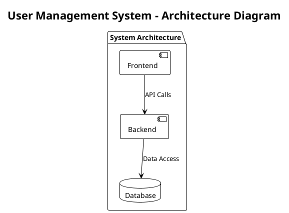

# API Reference - MCP Server Semantic Analysis

This document provides comprehensive API documentation for all tools and agents available in the MCP Semantic Analysis Server.

## Overview

The MCP Server provides **12 specialized tools** accessible through the Model Context Protocol, each backed by intelligent agents for sophisticated analysis and knowledge management.

## Tool Categories

### 🔌 Connection & Health Tools

#### `heartbeat()`
**Description**: Server health monitoring and uptime tracking

**Parameters**: None

**Returns**:
```typescript
{
  content: [{
    type: "text",
    text: string  // "💗 Heartbeat received. Server uptime: {uptime}s"
  }]
}
```

**Example**:
```typescript
// Usage in coding agent
heartbeat()

// Response
"💗 Heartbeat received. Server uptime: 145.7s"
```

**Use Cases**:
- Monitor server availability
- Track system uptime
- Verify MCP connection health
- Debugging connection issues

---

#### `test_connection()`
**Description**: Comprehensive server connectivity and status verification

**Parameters**: None

**Returns**:
```typescript
{
  content: [{
    type: "text",
    text: string  // Detailed connection information
  }]
}
```

**Response Format**:
```
✅ Semantic Analysis MCP Server Connection Test

Server Status: CONNECTED
Timestamp: 2025-01-15T10:30:45.123Z
Node.js Version: v18.17.0
Platform: darwin
PID: 12345

All systems operational!
```

**Use Cases**:
- Verify server configuration
- Debug MCP connectivity issues
- Check system information
- Validate environment setup

---

### 🔍 Analysis Tools

#### `determine_insights(content, context?, analysis_type?, provider?)`
**Description**: AI-powered content analysis with multi-provider LLM support

**Parameters**:
```typescript
{
  content: string;           // Required: Content to analyze
  context?: string;          // Optional: Additional context
  analysis_type?: "general" | "code" | "patterns" | "architecture";
  provider?: "anthropic" | "openai" | "auto";
}
```

**Returns**:
```typescript
{
  content: [{
    type: "text",
    text: string  // Formatted insights with metadata
  }]
}
```

**Example**:
```typescript
// Analyze code patterns
determine_insights(
  "class UserService { constructor(private db: Database) {} }",
  "TypeScript service class",
  "patterns",
  "anthropic"
)

// Response
# Semantic Analysis Insights

## Key Patterns Identified
- Dependency Injection Pattern
- Service Layer Architecture
- Constructor Injection

## Technical Insights
- Clean separation of concerns
- Testable design through DI
- Database abstraction

## Metadata
- Provider: anthropic
- Analysis Type: patterns
- Timestamp: 2025-01-15T10:30:45.123Z
```

**Use Cases**:
- Extract insights from conversations
- Analyze code snippets for patterns
- Generate architectural recommendations
- Create knowledge base entries

---

#### `analyze_code(code, language?, file_path?, analysis_focus?)`
**Description**: Specialized code analysis for patterns, quality, and architecture

**Parameters**:
```typescript
{
  code: string;              // Required: Code to analyze
  language?: string;         // Optional: Programming language
  file_path?: string;        // Optional: File path for context
  analysis_focus?: "patterns" | "quality" | "security" | "performance" | "architecture";
}
```

**Returns**:
```typescript
{
  content: [{
    type: "text",
    text: string  // Structured code analysis results
  }]
}
```

**Example**:
```typescript
// Analyze React component
analyze_code(
  "function UserProfile({ user }) { return <div>{user.name}</div>; }",
  "javascript",
  "components/UserProfile.jsx",
  "patterns"
)

// Response
# Code Analysis Results

## Analysis Summary
React functional component with props destructuring

## Findings
- Clean functional component pattern
- Props destructuring for readability
- Simple JSX structure
- Missing PropTypes/TypeScript validation

## Recommendations
- Add TypeScript or PropTypes for type safety
- Consider memo() for performance optimization
- Add error boundary handling
- Implement loading states
```

**Use Cases**:
- Code review assistance
- Pattern identification
- Quality assessment
- Security vulnerability detection
- Performance optimization suggestions

---

#### `analyze_repository(repository_path, include_patterns?, exclude_patterns?, max_files?)`
**Description**: Comprehensive repository-wide analysis and pattern extraction

**Parameters**:
```typescript
{
  repository_path: string;    // Required: Path to repository
  include_patterns?: string[]; // Optional: File patterns to include
  exclude_patterns?: string[]; // Optional: File patterns to exclude
  max_files?: number;         // Optional: Maximum files to analyze
}
```

**Returns**:
```typescript
{
  content: [{
    type: "text",
    text: string  // Repository analysis report
  }]
}
```

**Example**:
```typescript
// Analyze TypeScript project
analyze_repository(
  "/path/to/project",
  ["*.ts", "*.tsx"],
  ["node_modules", "*.test.ts"],
  100
)

// Response
# Repository Analysis

## Structure Overview
- Total files analyzed: 87
- Languages detected: TypeScript (95%), JavaScript (5%)
- Architecture: Monorepo with micro-frontend structure

## Key Patterns
- Clean Architecture with domain separation
- Dependency Injection throughout services
- Command Query Responsibility Segregation (CQRS)
- Event-driven communication

## Architecture Insights
- Well-structured domain boundaries
- Consistent naming conventions
- Good separation of concerns
- Potential for further modularization
```

**Use Cases**:
- Repository architecture analysis
- Migration planning
- Code quality assessment
- Pattern consistency verification
- Technical debt identification

---

#### `extract_patterns(source, pattern_types?, context?)`
**Description**: Extract and document reusable design and architectural patterns

**Parameters**:
```typescript
{
  source: string;             // Required: Source content to analyze
  pattern_types?: string[];   // Optional: Specific pattern types to look for
  context?: string;           // Optional: Additional context
}
```

**Returns**:
```typescript
{
  content: [{
    type: "text",
    text: string  // Extracted patterns with implementations
  }]
}
```

**Example**:
```typescript
// Extract patterns from codebase
extract_patterns(
  "class EventBus { subscribe(event, handler) { ... } }",
  ["observer", "publisher-subscriber"],
  "Event handling system"
)

// Response
# Extracted Patterns

## Observer Pattern

**Type:** Behavioral Pattern

**Description:** Implements event subscription and notification mechanism

**Implementation:**
```javascript
class EventBus {
  constructor() {
    this.listeners = new Map();
  }
  
  subscribe(event, handler) {
    if (!this.listeners.has(event)) {
      this.listeners.set(event, []);
    }
    this.listeners.get(event).push(handler);
  }
}
```
```

**Use Cases**:
- Document architectural patterns
- Create pattern libraries
- Extract reusable solutions
- Generate pattern documentation

---

### 📚 Knowledge Management Tools

#### `create_ukb_entity_with_insight(entity_name, entity_type, insights, significance?, tags?)`
**Description**: Create knowledge base entities with detailed insights

**Parameters**:
```typescript
{
  entity_name: string;        // Required: Name for the entity
  entity_type: string;        // Required: Type (Pattern, Workflow, etc.)
  insights: string;           // Required: Detailed insights content
  significance?: number;      // Optional: 1-10 significance score
  tags?: string[];           // Optional: Categorization tags
}
```

**Returns**:
```typescript
{
  content: [{
    type: "text",
    text: string  // Entity creation status and details
  }]
}
```

**Example**:
```typescript
// Create a pattern entity
create_ukb_entity_with_insight(
  "ReactHookPattern",
  "DesignPattern",
  "Custom hooks for stateful logic reuse in React applications...",
  8,
  ["react", "hooks", "patterns", "frontend"]
)

// Response
# UKB Entity Created

**Name:** ReactHookPattern
**Type:** DesignPattern
**Significance:** 8/10

## Status
✅ Successfully created

## Details
Entity created in knowledge base with proper relationships established.
Cross-references added to React and Frontend technology nodes.
```

**Use Cases**:
- Capture architectural insights
- Document design patterns
- Store lessons learned
- Build organizational knowledge

---

#### `execute_workflow(workflow_name, parameters?)`
**Description**: Execute predefined multi-agent analysis workflows

**Parameters**:
```typescript
{
  workflow_name: string;      // Required: Workflow identifier
  parameters?: object;        // Optional: Workflow-specific parameters
}
```

**Available Workflows**:
- `complete-analysis`: Full repository analysis with all agents
- `incremental-analysis`: Analyze only recent changes
- `pattern-extraction`: Focus on design pattern identification
- `documentation-generation`: Generate comprehensive documentation

**Returns**:
```typescript
{
  content: [{
    type: "text",
    text: string  // Workflow execution status and results
  }]
}
```

**Example**:
```typescript
// Execute comprehensive analysis
execute_workflow("complete-analysis", {
  repository_path: "/path/to/project",
  include_documentation: true,
  generate_diagrams: true
})

// Response
# Workflow Execution

**Workflow:** complete-analysis
**Description:** Full repository analysis with all agents

## Status
⚡ Workflow execution started

## Parameters
{
  "repository_path": "/path/to/project",
  "include_documentation": true,
  "generate_diagrams": true
}

## Agents Involved
- Repository Analyzer: Structure analysis
- Semantic Analyzer: Code insights
- Documentation Agent: Report generation
- Knowledge Manager: Entity creation
```

**Use Cases**:
- Comprehensive project analysis
- Automated documentation generation
- Knowledge base population
- Multi-step analysis pipelines

---

### 📄 Documentation & Reporting Tools

#### `generate_documentation(analysis_result, metadata?)`
**Description**: Generate comprehensive documentation from analysis results

**Parameters**:
```typescript
{
  analysis_result: object;    // Required: Analysis results to document
  metadata?: object;          // Optional: Additional metadata
}
```

**Returns**:
```typescript
{
  content: [{
    type: "text",
    text: string  // Generated documentation in Markdown
  }]
}
```

**Example**:
```typescript
// Generate documentation from analysis
generate_documentation(
  { patterns: ["Factory", "Observer"], insights: "..." },
  { project: "E-commerce Platform", version: "2.1.0" }
)

// Response
# Generated Documentation

## Project Analysis Summary

### Identified Patterns
- **Factory Pattern**: Used for payment processor creation
- **Observer Pattern**: Event handling system

### Architecture Insights
- Clean separation between domain and infrastructure
- Well-defined API boundaries
- Consistent error handling

## Metadata
- Generated: 2025-01-15T10:30:45.123Z
- Format: Markdown
```

**Use Cases**:
- Automated technical documentation
- Analysis result formatting
- Knowledge sharing
- Project documentation maintenance

---

#### `create_insight_report(analysis_result, metadata?)`
**Description**: Create detailed insight reports with structured analysis

**Parameters**:
```typescript
{
  analysis_result: object;    // Required: Analysis results
  metadata?: object;          // Optional: Report metadata
}
```

**Returns**:
```typescript
{
  content: [{
    type: "text",
    text: string  // Structured insight report
  }]
}
```

**Example**:
```typescript
// Create insight report
create_insight_report(
  { codeQuality: 85, patterns: 12, issues: 3 },
  { name: "Q4 Code Review", type: "Quarterly" }
)

// Response
# Insight Report: Q4 Code Review

**Type:** Quarterly
**Generated:** 2025-01-15T10:30:45.123Z

## Analysis Summary
{
  "codeQuality": 85,
  "patterns": 12,
  "issues": 3
}

## Key Insights
- Pattern detection and analysis completed
- Architecture insights extracted
- Recommendations generated
```

**Use Cases**:
- Quarterly reviews
- Stakeholder reporting
- Progress tracking
- Quality metrics

---

#### `generate_plantuml_diagrams(diagram_type, content, name, analysis_result?)`
**Description**: Generate PlantUML diagrams for architecture visualization

**Parameters**:
```typescript
{
  diagram_type: "architecture" | "sequence" | "use-cases" | "class";
  content: string;            // Required: Content/title for diagram
  name: string;               // Required: Base name for files
  analysis_result?: object;   // Optional: Analysis context
}
```

**Returns**:
```typescript
{
  content: [{
    type: "text",
    text: string  // PlantUML code and file information
  }]
}
```

**Example**:
```typescript
// Generate architecture diagram
generate_plantuml_diagrams(
  "architecture",
  "User Management System",
  "user-system",
  { components: ["API", "Database", "Auth"] }
)

// Response
# PlantUML Diagram Generated

**Name:** user-system
**Type:** architecture
**Content:** User Management System

## Diagram Code


## Files Created
- user-system_architecture.puml
- user-system_architecture.svg (pending generation)
```

**Use Cases**:
- Architecture documentation
- Visual system design
- Communication aids
- Technical presentations

---

#### `generate_lessons_learned(analysis_result, title?, metadata?)`
**Description**: Generate structured lessons learned documents

**Parameters**:
```typescript
{
  analysis_result: object;    // Required: Analysis results
  title?: string;             // Optional: Document title
  metadata?: object;          // Optional: Additional metadata
}
```

**Returns**:
```typescript
{
  content: [{
    type: "text",
    text: string  // Structured lessons learned document
  }]
}
```

**Example**:
```typescript
// Generate lessons learned
generate_lessons_learned(
  { successes: ["Clean architecture"], challenges: ["Performance"] },
  "Project Alpha Retrospective"
)

// Response
# Project Alpha Retrospective

**Generated:** 2025-01-15T10:30:45.123Z
**Type:** Lessons Learned Document (LELE)

## Executive Summary
This document captures key lessons learned from the semantic analysis.

## Key Lessons
1. Architecture patterns identified and documented
2. Code quality metrics established
3. Performance optimization opportunities found
4. Security considerations highlighted
5. Technical debt areas mapped

## Recommendations
1. **Immediate Actions**
   - Apply identified patterns consistently
   - Address critical security findings
2. **Long-term Improvements**
   - Refactor technical debt areas
   - Enhance documentation coverage
```

**Use Cases**:
- Project retrospectives
- Knowledge capture
- Best practice documentation
- Organizational learning

---

## Agent APIs

### CoordinatorAgent
**Purpose**: Orchestrates workflows and coordinates between agents

**Key Methods**:
```typescript
class CoordinatorAgent {
  async executeWorkflow(name: string, params: object): Promise<WorkflowResult>;
  async validateOutput(result: any): Promise<ValidationResult>;
  async monitorExecution(workflowId: string): Promise<ExecutionStatus>;
}
```

---

### SemanticAnalyzer
**Purpose**: AI-powered content and code analysis

**Key Methods**:
```typescript
class SemanticAnalyzer {
  async analyzeContent(content: string, options: AnalysisOptions): Promise<AnalysisResult>;
  async analyzeCode(code: string, options: CodeOptions): Promise<CodeAnalysis>;
  async extractPatterns(source: string, options: PatternOptions): Promise<PatternResult>;
}
```

---

### KnowledgeManager
**Purpose**: Knowledge base management and integration

**Key Methods**:
```typescript
class KnowledgeManager {
  async createUkbEntity(entity: EntityData): Promise<EntityResult>;
  async updateKnowledgeBase(data: any): Promise<UpdateResult>;
  async searchKnowledge(query: string): Promise<SearchResult>;
}
```

---

### RepositoryAnalyzer
**Purpose**: Repository structure and pattern analysis

**Key Methods**:
```typescript
class RepositoryAnalyzer {
  async analyzeRepository(path: string, options: RepoOptions): Promise<RepoAnalysis>;
  async scanFiles(patterns: string[]): Promise<FileInfo[]>;
  async extractStructure(path: string): Promise<StructureInfo>;
}
```

---

## Error Handling

All tools implement consistent error handling:

```typescript
interface ErrorResponse {
  content: [{
    type: "text",
    text: string;  // Error message
  }];
  isError: true;
}
```

**Common Error Types**:
- **ValidationError**: Invalid input parameters
- **ProviderError**: LLM provider unavailable
- **TimeoutError**: Operation timeout
- **AuthenticationError**: Invalid API keys
- **ResourceError**: File/directory not found

---

## Rate Limiting & Performance

### Rate Limits
- **Anthropic**: 50 requests/minute
- **OpenAI**: 100 requests/minute
- **Web Search**: 20 requests/minute

### Performance Optimization
- **Caching**: Intelligent caching of analysis results
- **Batching**: Grouping of similar operations
- **Parallel Processing**: Concurrent agent execution
- **Streaming**: Real-time response streaming for large operations

---

## Usage Examples

### Basic Code Analysis Workflow
```typescript
// 1. Test connection
await test_connection();

// 2. Analyze code
const codeAnalysis = await analyze_code(sourceCode, "typescript");

// 3. Extract patterns
const patterns = await extract_patterns(sourceCode);

// 4. Generate documentation
const docs = await generate_documentation(patterns);

// 5. Store in knowledge base
await create_ukb_entity_with_insight("MyPattern", "DesignPattern", docs);
```

### Repository Analysis Pipeline
```typescript
// 1. Full repository analysis
const repoAnalysis = await analyze_repository("/path/to/repo");

// 2. Execute comprehensive workflow
const workflow = await execute_workflow("complete-analysis", {
  repository_path: "/path/to/repo",
  generate_diagrams: true
});

// 3. Generate final report
const report = await create_insight_report(workflow.result);

// 4. Create lessons learned
await generate_lessons_learned(workflow.result, "Repository Analysis");
```

---

## Related Documentation

- **[Architecture Guide](../architecture/README.md)** - System design and implementation
- **[Installation Guide](../installation/README.md)** - Setup and configuration
- **[Use Cases](../use-cases/README.md)** - Practical examples and workflows
- **[Troubleshooting](../troubleshooting/README.md)** - Common issues and solutions