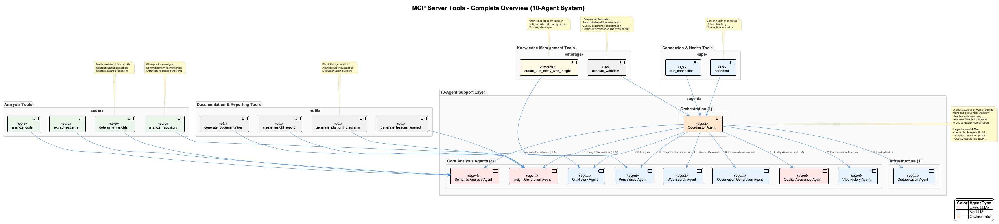
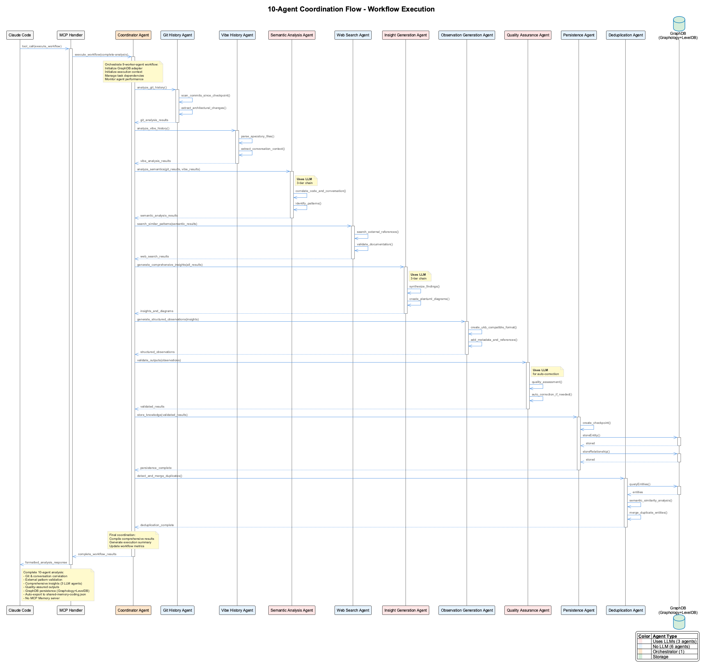

# Architecture Documentation - MCP Server Semantic Analysis

This document provides a comprehensive overview of the MCP Semantic Analysis Server architecture, design patterns, and technical implementation details.

## System Overview

The MCP Semantic Analysis Server is a sophisticated Node.js application built with TypeScript that implements the Model Context Protocol (MCP) to provide AI-powered semantic analysis capabilities to Claude Code and other MCP-compatible clients.


### Core Design Principles

1. **Modularity**: Clean separation between tools, agents, and infrastructure
2. **Extensibility**: Easy addition of new tools and agents
3. **Reliability**: Robust error handling and graceful degradation
4. **Performance**: Efficient resource utilization and caching
5. **Observability**: Comprehensive logging and monitoring

## Architecture Layers

### 1. MCP Protocol Layer
**Purpose**: Handles Model Context Protocol communication with Claude Code

**Components**:
- `MCP Protocol Handler`: Core MCP server implementation
- `Tool Registry`: Registration and dispatch of available tools
- `Request/Response Processing`: Message serialization and validation

**Key Features**:
- Standards-compliant MCP implementation
- Automatic tool discovery and registration
- Request validation and sanitization
- Response formatting and error handling

### 2. Tool Layer (12 Tools)
**Purpose**: Provides the public API interface for MCP clients



#### Connection & Health Tools
- **`heartbeat`**: Server health monitoring and uptime tracking
- **`test_connection`**: Comprehensive connection diagnostics

#### Analysis Tools
- **`determine_insights`**: AI-powered content analysis with multi-provider support
- **`analyze_code`**: Code quality, patterns, and architecture analysis
- **`analyze_repository`**: Repository-wide structure and pattern analysis
- **`extract_patterns`**: Design pattern identification and documentation

#### Knowledge Management Tools
- **`create_ukb_entity_with_insight`**: Knowledge base entity creation
- **`execute_workflow`**: Multi-agent workflow orchestration

#### Documentation & Reporting Tools
- **`generate_documentation`**: Automated technical documentation
- **`create_insight_report`**: Comprehensive analysis reports
- **`generate_plantuml_diagrams`**: Architecture diagram generation
- **`generate_lessons_learned`**: Lessons learned document creation

### 3. Agent Layer (11 Specialized Agents)
**Purpose**: Implements the core business logic and intelligence



#### Orchestration Agent

##### CoordinatorAgent
**Responsibilities**:
- Workflow orchestration and task scheduling
- Inter-agent communication coordination
- Error recovery and rollback management
- Performance monitoring and metrics

**Key Features**:
- Multi-step workflow execution
- Agent lifecycle management
- Quality assurance coordination
- Rollback capabilities

#### Core Analysis Agents (8 Agents)

##### GitHistoryAgent
**Responsibilities**:
- Git commit analysis from checkpoint
- Repository change pattern extraction
- Development timeline analysis

**Key Features**:
- Commit traversal optimization
- Change significance scoring
- Architectural decision identification
- Checkpoint management

##### VibeHistoryAgent
**Responsibilities**:
- Conversation history processing
- Context extraction from .specstory/history
- Session continuity analysis

**Key Features**:
- Markdown parsing and analysis
- Session correlation
- Context preservation
- Insight extraction from discussions

##### SemanticAnalysisAgent
**Responsibilities**:
- Deep code analysis and correlation
- Git and conversation data integration
- Pattern recognition and extraction

**Key Features**:
- Multi-source correlation
- Semantic pattern analysis
- Architectural insight generation
- Code quality assessment

##### WebSearchAgent
**Responsibilities**:
- External pattern research
- Reference validation and discovery
- Technical documentation search

**Key Features**:
- Multiple search provider support
- Intelligent query construction
- Result relevance scoring
- Rate limiting and caching

##### InsightGenerationAgent
**Responsibilities**:
- Comprehensive insight generation
- PlantUML diagram creation
- Pattern documentation

**Key Features**:
- Multi-provider LLM support
- Diagram generation pipeline
- Insight quality validation
- Template-based generation

##### ObservationGenerationAgent
**Responsibilities**:
- Structured observation creation
- UKB-compatible formatting
- Knowledge base integration

**Key Features**:
- Observation structuring
- Metadata generation
- Quality validation
- Cross-referencing

##### QualityAssuranceAgent
**Responsibilities**:
- Output validation and correction
- Quality metrics assessment
- Error detection and recovery

**Key Features**:
- Multi-level validation
- Auto-correction capabilities
- Quality scoring
- Retry logic management

##### PersistenceAgent
**Responsibilities**:
- Knowledge base persistence
- Checkpoint creation and management
- Storage coordination

**Key Features**:
- Multi-target persistence
- Checkpoint optimization
- Storage validation
- Recovery management

#### Infrastructure Agents (2 Agents)

##### SynchronizationAgent
**Responsibilities**:
- Multi-source data synchronization
- Conflict resolution
- Backup management

**Key Features**:
- Real-time sync monitoring
- Conflict detection and resolution
- Rollback capabilities
- Data integrity validation

##### DeduplicationAgent
**Responsibilities**:
- Semantic duplicate detection
- Entity merging strategies
- Similarity analysis

**Key Features**:
- Embedding-based similarity
- Configurable merge strategies
- Batch processing optimization
- Performance metrics

## Data Flow Architecture

### Request Processing Flow
```
Claude Code → MCP Handler → Tool Registry → Coordinator Agent → Specialized Agents → External Services → Response
```

### Workflow Execution
1. **Request Validation**: Input sanitization and parameter validation
2. **Workflow Planning**: Task decomposition and agent assignment
3. **Parallel Execution**: Concurrent agent processing where possible
4. **Quality Assurance**: Output validation and quality checks
5. **Result Compilation**: Response formatting and enrichment
6. **Knowledge Persistence**: Storage and synchronization

### Agent Coordination
```typescript
interface WorkflowExecution {
  id: string;
  type: WorkflowType;
  steps: WorkflowStep[];
  coordinator: CoordinatorAgent;
  agents: Map<string, Agent>;
  context: ExecutionContext;
  metrics: PerformanceMetrics;
}
```

## Technical Implementation

### Technology Stack
- **Runtime**: Node.js 18+
- **Language**: TypeScript 5.0+
- **Protocol**: Model Context Protocol (MCP)
- **AI Providers**: Anthropic Claude, OpenAI GPT
- **Search**: DuckDuckGo, custom APIs
- **Diagrams**: PlantUML
- **Logging**: Structured JSON logging

### Project Structure
```
src/
├── index.ts                        # MCP server entry point
├── server.ts                       # Core MCP server implementation
├── tools.ts                        # Tool definitions and handlers
├── logging.ts                      # Logging utilities
└── agents/                         # Agent implementations (10 agents)
    ├── coordinator.ts              # Orchestration agent
    ├── git-history-agent.ts        # Core analysis agents
    ├── vibe-history-agent.ts
    ├── semantic-analysis-agent.ts
    ├── web-search.ts
    ├── insight-generation-agent.ts
    ├── observation-generation-agent.ts
    ├── quality-assurance-agent.ts
    ├── persistence-agent.ts
    ├── synchronization.ts          # Infrastructure agents
    ├── deduplication.ts
    └── semantic-analyzer.ts        # Utility class (not an agent)
```

### Key Design Patterns

#### Agent Pattern
```typescript
abstract class Agent {
  abstract getName(): string;
  abstract getCapabilities(): string[];
  abstract execute(task: Task): Promise<Result>;
  
  protected async validateInput(input: any): Promise<boolean> { /* ... */ }
  protected async logMetrics(metrics: Metrics): Promise<void> { /* ... */ }
}
```

#### Provider Pattern
```typescript
interface LLMProvider {
  name: string;
  isAvailable(): Promise<boolean>;
  analyze(content: string, options: AnalysisOptions): Promise<AnalysisResult>;
  getUsageMetrics(): UsageMetrics;
}
```

#### Workflow Pattern
```typescript
interface Workflow {
  name: string;
  steps: WorkflowStep[];
  execute(context: ExecutionContext): Promise<WorkflowResult>;
  rollback(stepIndex: number): Promise<void>;
}
```

## Configuration Management

### Environment-Based Configuration
```typescript
interface ServerConfig {
  server: {
    port: number;
    logLevel: LogLevel;
    enableMetrics: boolean;
  };
  llm: {
    providers: ProviderConfig[];
    defaultProvider: string;
    fallbackChain: string[];
  };
  agents: {
    [key: string]: AgentConfig;
  };
  knowledge: {
    baseUrl: string;
    syncEnabled: boolean;
    backupPath: string;
  };
}
```

### Runtime Configuration
- **Hot Reloading**: Configuration changes without restart
- **Feature Flags**: Enable/disable features dynamically
- **Rate Limiting**: Provider-specific rate limits
- **Caching**: Configurable cache policies

## Performance Characteristics

### Scalability
- **Horizontal Scaling**: Multiple server instances with load balancing
- **Vertical Scaling**: Multi-core agent processing
- **Resource Management**: Memory and CPU optimization
- **Caching Strategy**: Multi-level caching for frequently accessed data

### Performance Metrics
- **Latency**: P50, P95, P99 response times
- **Throughput**: Requests per second capacity
- **Resource Usage**: Memory, CPU, and network utilization
- **Error Rates**: Success/failure ratios by operation type

### Optimization Strategies
- **Connection Pooling**: Reuse of HTTP connections
- **Request Batching**: Grouping of similar operations
- **Intelligent Caching**: Context-aware cache policies
- **Async Processing**: Non-blocking I/O operations

## Security Architecture

### Authentication & Authorization
- **API Key Management**: Secure storage and rotation
- **Request Validation**: Input sanitization and validation
- **Rate Limiting**: DDoS protection and fair usage
- **Audit Logging**: Comprehensive security event logging

### Data Protection
- **Encryption**: In-transit and at-rest encryption
- **Sanitization**: Removal of sensitive information
- **Access Control**: Principle of least privilege
- **Data Retention**: Configurable retention policies

## Monitoring & Observability

### Logging Strategy
```typescript
interface LogEntry {
  timestamp: string;
  level: LogLevel;
  component: string;
  message: string;
  metadata: Record<string, any>;
  traceId: string;
  correlationId: string;
}
```

### Metrics Collection
- **System Metrics**: CPU, memory, disk, network
- **Application Metrics**: Request rates, latencies, errors
- **Business Metrics**: Analysis completions, knowledge creation
- **Custom Metrics**: Agent-specific performance indicators

### Health Checks
- **Liveness Probes**: Server availability
- **Readiness Probes**: Service readiness
- **Dependency Checks**: External service availability
- **Performance Checks**: Response time thresholds

## Extension Points

### Adding New Tools
1. Define tool schema in `tools.ts`
2. Implement handler function
3. Register with tool registry
4. Add appropriate agent integration
5. Write tests and documentation

### Creating Custom Agents
1. Extend base `Agent` class
2. Implement required abstract methods
3. Register with coordinator
4. Configure in agent configuration
5. Add monitoring and metrics

### Provider Integration
1. Implement `LLMProvider` interface
2. Add provider configuration
3. Integrate with fallback chain
4. Add provider-specific metrics
5. Test failover scenarios

## Future Architecture Considerations

### Planned Enhancements
- **Distributed Processing**: Multi-node cluster support
- **Advanced Caching**: Redis/Memcached integration
- **Stream Processing**: Real-time data processing
- **Machine Learning**: Custom model integration

### Scalability Roadmap
- **Microservices**: Service decomposition
- **Event Sourcing**: Event-driven architecture
- **CQRS**: Command Query Responsibility Segregation
- **API Gateway**: Centralized API management

## Related Documentation

- **[Installation Guide](../installation/README.md)** - Setup and configuration
- **[API Reference](../api/README.md)** - Tool and agent APIs
- **[Use Cases](../use-cases/README.md)** - Practical examples
- **[Troubleshooting](../troubleshooting/README.md)** - Common issues and solutions